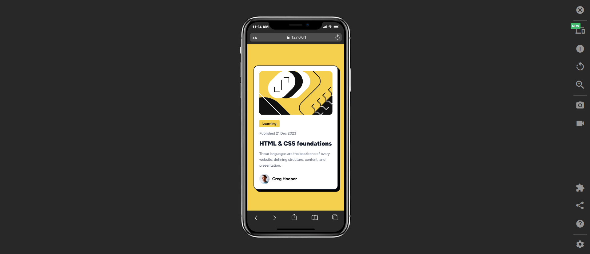

# Frontend Mentor - Blog preview card solution

This is a solution to the [Blog preview card challenge on Frontend Mentor](https://www.frontendmentor.io/challenges/blog-preview-card-ckPaj01IcS).  

## Overview

### Welcome! 👋
- Thanks for checking out this front-end coding challenge.  
- This project focuses on creating a responsive blog preview card that looks identical across both mobile and desktop screen sizes.

---
### The challenge
Users should be able to:
- View the card layout on mobile and desktop.
- See hover states for interactive elements.

### Screenshot

### Links
- **Solution URL:** [Repository link](#)
- **Live Site URL:** [Click here](#)

---

## My process

### Built with

- Semantic **HTML5** markup  
- **Tailwind CSS** for styling  
- **CSS Grid** and **Flexbox** for layout  
- **Mobile-first** responsive workflow  

### What I learned
I practiced building a responsive component with Tailwind, using for adaptive font sizes and widths. Small details like shadows, spacing, and hover states made the component feel more polished.

### Continued development
In future projects, I plan to focus more on accessibility features (like ARIA labels and keyboard navigation), improving hover transitions, and experimenting with component-driven design using Tailwind and utility-first workflows.

### Useful resources
- Tailwind CSS docs    
- and other online resources

---

## Author
- Frontend Mentor - [@saramx-dev](https://www.frontendmentor.io/profile/saramx-dev)  
- Twitter - [@saramx_dev](https://x.com/saramx_dev)  
- LinkedIn - [Sara Mohamed](https://www.linkedin.com/in/saramx-dev/)  

---

## Acknowledgments
Thanks to the Frontend Mentor team and community for providing these hands-on challenges that make front-end practice both practical and enjoyable.
